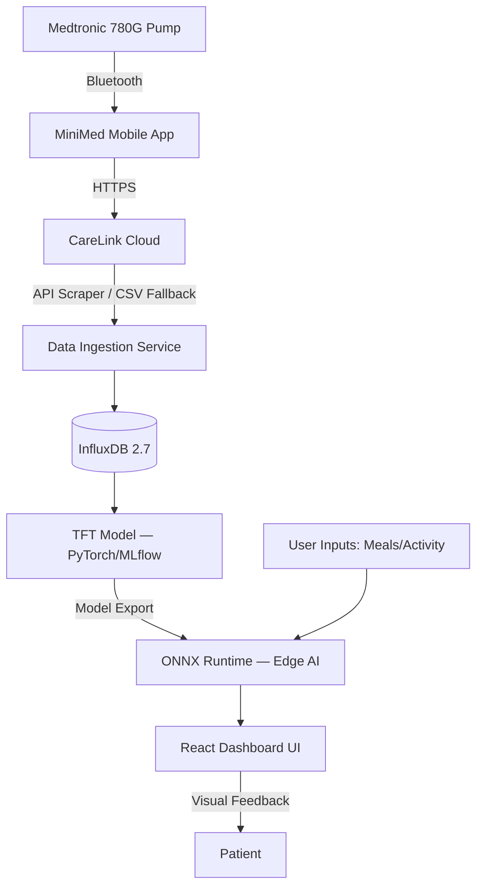

# 🧠 NeuroMetabolic Dashboard (NMD)

> AI-driven decision-support system for Type 1 Diabetes management — predicting glycemic trends using Temporal Fusion Transformers and closed-loop pump data.

[](https://github.com/Radian20Hz/NeuroMetabolic-Dashboard/actions)
[](https://python.org)
[](LICENSE)
[](https://github.com/Radian20Hz/NeuroMetabolic-Dashboard)

> 🚧 **Active Development** — Phase 2 complete, Phase 3 in progress (Q2 2026). This repository documents a 24-month engineering journey toward a production-ready clinical decision-support tool.

---

## 💡 Motivation

This project is built by a T1D patient, not just *for* T1D patients.

The developer wears a **Medtronic 780G closed-loop insulin pump** every day — which means this is not an academic exercise. The data this system processes is the same data that determines insulin delivery in real life. That personal stake is what drives the engineering decisions: precision over convenience, explainability over black-box accuracy, and patient safety above all else.

---

## 📌 Overview

The **NeuroMetabolic Dashboard** integrates real-time CGM data from the **Medtronic 780G** closed-loop system with a **Temporal Fusion Transformer (TFT)** model to provide:

- 📈 High-precision **blood glucose predictions** (up to 60-min horizon)
- 🔬 **"What-If" metabolic simulator** — visualize the impact of meals and exercise *before* they happen
- 🚨 **Proactive alert system** — 20-minute lead time before predicted hypoglycemia
- 🧩 **Explainable AI (XAI)** — TFT attention maps for variable importance visualization

> ⚠️ **Medical Disclaimer:** NMD is a decision-support tool only. It is not a replacement for professional medical advice or automated insulin delivery (AID) logic.

---

## 🏗️ Architecture



---

## 🛠️ Tech Stack

| Layer | Technology |
|---|---|
| **Backend** | Python 3.12, FastAPI |
| **Database** | InfluxDB 2.7 (time-series) |
| **ML Framework** | PyTorch, Temporal Fusion Transformer |
| **Inference** | ONNX Runtime (Edge AI) |
| **Frontend** | React 18, TypeScript, Tailwind CSS, Recharts |
| **MLOps** | MLflow, DVC |
| **CI/CD** | GitHub Actions, Flake8, MyPy, PyTest |
| **Containerization** | Docker, Docker Compose |
| **Security** | OAuth2 + JWT, AES-256 |

---

## 📁 Project Structure

```
neurometabolic-dashboard/
├── backend/                  # FastAPI application
│   ├── app/
│   │   ├── api/              # Route handlers
│   │   ├── core/             # Config, security, dependencies
│   │   ├── models/           # Pydantic schemas
│   │   └── services/         # Business logic
│   └── tests/
│       └── unit/             # 45 tests — all passing
├── frontend/                 # React + TypeScript dashboard
│   └── src/
│       ├── api/              # Axios API client
│       ├── components/       # GlucoseChart, StatsCards, UploadPanel
│       ├── hooks/            # useGlucoseData
│       └── types/            # Shared TypeScript interfaces
├── ml/                       # ML pipeline (Phase 3)
│   ├── data/
│   │   ├── raw/              # OhioT1DM dataset (gitignored)
│   │   └── processed/        # Normalized features
│   ├── scripts/              # Preprocessing & training
│   └── notebooks/            # Exploratory analysis
├── docker-compose.yml        # InfluxDB local setup
└── .github/
    └── workflows/            # CI/CD pipelines
```

---

## ✅ Progress

### Phase 1 — ETL Pipeline ✅ Complete

- [x] CareLink CSV parser — handles real Medtronic 780G export format
- [x] InfluxDB service — write and query glucose time-series data
- [x] REST API — `/upload`, `/latest` endpoints
- [x] Pydantic response models
- [x] GitHub Actions CI/CD pipeline (flake8 + mypy + pytest)

### Phase 2 — Clinical Intelligence Layer ✅ Complete

- [x] Glucose Validator — ADA 2024 clinical zone classification (5 zones)
- [x] Time-in-Range (TIR) calculator — ADA target: >70%
- [x] GMI (Glucose Management Indicator) — Bergenstal 2018 formula
- [x] CV (Coefficient of Variation) — stability flag at <36% threshold
- [x] Full glycemic statistics engine (min/max/avg/std\_dev/TIR/GMI/CV)
- [x] `/classify` endpoint — single reading ADA zone classification
- [x] `/statistics` endpoint — full CSV statistical analysis
- [x] `/scrape` endpoint — live CareLink EU API ingestion
- [x] Background auto-fetch task (5 min interval, 60 min token cache)
- [x] InfluxDB singleton — connection pooling via FastAPI Depends()
- [x] Stats enrichment on upload response
- [x] React frontend — GlucoseChart, StatsCards, UploadPanel
- [x] **45 unit tests — all passing**

### Phase 3 — TFT Model 🔄 In Progress

- [x] ML pipeline directory scaffold
- [x] OhioT1DM dataset preprocessing script
- [ ] Feature engineering (IOB, CHO, activity windows)
- [ ] TFT architecture implementation (PyTorch)
- [ ] MLflow experiment tracking
- [ ] ONNX export for edge inference
- [ ] MARD validation < 10%

### Phase 4 — Production Hardening 📅 Planned (Q1 2027)

- [ ] "What-If" metabolic simulator UI
- [ ] Proactive hypoglycemia alert system (20 min lead time)
- [ ] XAI — TFT attention map visualization
- [ ] Bilingual documentation (EN/JP)

---

## 🚀 Roadmap

| Phase | Timeline | Focus | Status |
|---|---|---|---|
| **Phase 1** | Q1–Q2 2026 | ETL pipeline + REST API | ✅ Complete |
| **Phase 2** | Q2 2026 | Clinical intelligence layer | ✅ Complete |
| **Phase 3** | Q3–Q4 2026 | TFT model + ONNX inference | 🔄 In Progress |
| **Phase 4** | Q1 2027 | Frontend + production hardening | 📅 Planned |

---

## ⚙️ Getting Started

### Prerequisites

- Python 3.12+
- Docker + Docker Compose
- Node.js 18+

### Installation

```bash
# Clone repository
git clone https://github.com/Radian20Hz/NeuroMetabolic-Dashboard.git
cd neurometabolic-dashboard

# Start InfluxDB
docker compose up -d

# Backend setup
cd backend
python -m venv venv
source venv/bin/activate  # Windows: venv\Scripts\activate
pip install -r requirements.txt

# Create .env file
cp .env.example .env  # fill in your InfluxDB credentials

# Frontend setup
cd ../frontend
npm install
npm run dev
```

### Running locally

```bash
# Backend — http://localhost:8000/docs
cd backend && uvicorn app.main:app --reload

# Frontend — http://localhost:5173
cd frontend && npm run dev

# InfluxDB UI — http://localhost:8086
docker compose up -d
```

### Running tests

```bash
cd backend
pytest tests/unit/ -v
# Expected: 45 passed
```

---

## 📊 Model Validation Targets

| Metric | Target |
|---|---|
| **MARD** (Mean Absolute Relative Difference) | < 10% |
| **Clarke Error Grid** zones A+B | > 95% |
| **Time-in-Range** prediction accuracy | > 90% |

---

## 🔒 Data Privacy & Compliance

- **GDPR/RODO compliant** — full de-identification at the extraction layer
- **OhioT1DM Dataset** — fully de-identified academic benchmark dataset
- **AES-256** encryption for data at rest
- **OAuth2 + JWT** for stateless authentication

---

## 📄 License

MIT License — see [LICENSE](LICENSE) for details.

---

*Built with ❤️ for the T1D community.*
