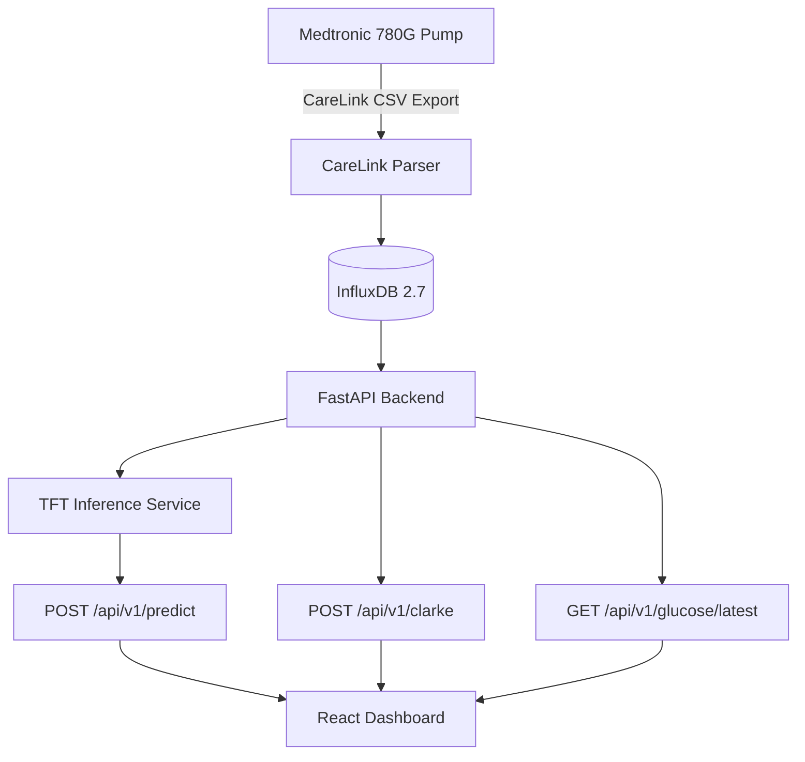

# 🧠 NeuroMetabolic Dashboard (NMD)

> AI-driven decision-support system for Type 1 Diabetes management — predicting glycemic trends using Temporal Fusion Transformers and real closed-loop pump data.

[](https://github.com/Radian20Hz/NeuroMetabolic-Dashboard/actions)
[](https://python.org)
[](LICENSE)
[](https://github.com/Radian20Hz/NeuroMetabolic-Dashboard)

> **Phase 3 complete** — TFT inference pipeline, Clarke Error Grid evaluator, and full-stack dashboard are live and running on real CGM data from a Medtronic 780G.

---

## 💡 Motivation

This project is built by a T1D patient, not just *for* T1D patients.

The developer wears a **Medtronic 780G closed-loop insulin pump** every day — which means this is not an academic exercise. The data this system processes is the same data that determines insulin delivery in real life. That personal stake drives every engineering decision: precision over convenience, explainability over black-box accuracy, patient safety above all else.

---

## 📌 What it does

- 📈 **60-minute glucose forecasting** — 12 × 5-min steps with 10th/50th/90th quantile confidence intervals via Temporal Fusion Transformer
- 🔬 **Clarke Error Grid Analysis** — deterministic zone classification (A–E) per Clarke et al. 1987, paired against real CGM readings
- 📊 **ADA 2024 glycemic metrics** — TIR, GMI (Bergenstal 2018), CV, std dev computed on real pump data
- 🩺 **Clinical zone classification** — ADA 2024 hypoglycemia/hyperglycemia thresholds (5 zones)
- 📥 **CareLink CSV ingestion** — parses real Medtronic 780G export format

> ⚠️ **Medical Disclaimer:** NMD is a research/decision-support tool only. It is not a replacement for professional medical advice or automated insulin delivery (AID) logic.

---

## 🏗️ Architecture


```mermaid
graph TD
  A[Medtronic 780G Pump] -->|CareLink CSV Export| B[CareLink Parser]
  B --> C[(InfluxDB 2.7)]
  C --> D[FastAPI Backend]
  D --> E[TFT Inference Service]
  E --> F[POST /api/v1/predict]
  F --> G[React Dashboard]
  D --> H[POST /api/v1/clarke]
  H --> G
  D --> I[GET /api/v1/glucose/latest]
  I --> G
```

---

## 🛠️ Tech Stack

| Layer | Technology |
|---|---|
| **Backend** | Python 3.12, FastAPI |
| **Database** | InfluxDB 2.7 (time-series) |
| **ML Model** | PyTorch, pytorch-forecasting, Temporal Fusion Transformer |
| **Inference** | `.ckpt` checkpoint — ONNX abandoned (data-dependent symbolic shapes in TFT encoder) |
| **Frontend** | React 19, TypeScript, Recharts, Tailwind CSS |
| **CI/CD** | GitHub Actions, flake8, pytest |
| **Containerization** | Docker, Docker Compose |

---

## 📁 Project Structure

```
neurometabolic-dashboard/
├── backend/
│   ├── app/
│   │   ├── api/
│   │   │   ├── clarke.py           # POST /api/v1/clarke
│   │   │   ├── glucose.py          # POST /upload, GET /latest, POST /classify
│   │   │   └── predict.py          # POST /api/v1/predict
│   │   ├── core/
│   │   │   └── config.py           # pydantic-settings, env vars
│   │   ├── models/
│   │   │   └── glucose.py          # Pydantic schemas
│   │   └── services/
│   │       ├── carelink_parser.py  # Medtronic 780G CSV parser
│   │       ├── carelink_scraper.py # CareLink EU scraper (limited, see below)
│   │       ├── clarke_egz.py       # Clarke EGA zone classifier
│   │       ├── glucose_validator.py
│   │       ├── influxdb_service.py # InfluxDB singleton
│   │       └── tft_inference.py    # TFT model loading + inference
│   └── tests/
│       └── unit/                   # 36 tests — all passing
├── frontend/
│   └── src/
│       ├── api/glucoseApi.ts
│       ├── components/
│       │   ├── ClarkeErrorGrid.tsx # SVG scatter plot, zones A-E
│       │   ├── GlucoseChart.tsx    # CGM trace + TFT forecast overlay
│       │   ├── StatsCards.tsx
│       │   └── UploadPanel.tsx
│       └── types/glucose.ts
├── ml/
│   ├── data/processed/             # training.parquet — OhioT1DM (gitignored)
│   ├── models/                     # TFT checkpoints (gitignored)
│   └── scripts/                    # preprocessing + training
├── docker-compose.yml
└── .github/workflows/ci.yml
```

---

## ✅ Progress

### Phase 1 — ETL Pipeline ✅
- CareLink CSV parser — real Medtronic 780G export format
- InfluxDB service — write/query glucose time-series
- REST API — `/upload`, `/latest`, `/classify`, `/statistics`
- GitHub Actions CI/CD (flake8 + pytest)
- 36 unit tests — all passing

### Phase 2 — Clinical Intelligence Layer ✅
- Glucose Validator — ADA 2024 clinical zone classification (5 zones)
- Glycemic statistics engine: TIR, GMI, CV
- Docker Compose stack — end-to-end pipeline with real pump data
- React frontend — GlucoseChart, StatsCards, UploadPanel

### Phase 3 — TFT Model + Full-Stack Dashboard ✅
- OhioT1DM preprocessing — 85,896 samples, 6 subjects, 14 features
- TFT training — `val_loss=1.710`, **MARD=1.09%**
- ONNX export attempted → abandoned (`GuardOnDataDependentSymNode` in TFT encoder)
- `POST /api/v1/predict` — 60-min forecast, quantile CI output
- `POST /api/v1/clarke` — Clarke Error Grid Analysis, zones A–E
- Full UI redesign — Apple-inspired medical aesthetic (DM Sans, clean cards)
- CGM trace + TFT forecast overlay + Clarke scatter plot

### Phase 4 — Multi-patient Generalization 📅
- Subject-agnostic inference (currently requires OhioT1DM subject ID)
- Proactive hypoglycemia alert system (20-min lead time)
- XAI — TFT attention map visualization
- Bilingual documentation (EN/JP)

---

## 📊 Model Performance

| Metric | Target | Result |
|---|---|---|
| **MARD** | < 10% | **1.09% ✅** |
| **Clarke EGA zones A+B** | > 95% | Evaluated per session |
| **val_loss (QuantileLoss)** | — | **1.710** |

Model: `tft-epoch=47-val_loss=1.7104.ckpt`
Training set: OhioT1DM subjects 559, 563, 570, 575, 588, 591

---

## 📥 Data Ingestion

**Current workflow:** Manual CSV export from carelink.minimed.eu → upload via NMD dashboard Upload panel.

**Why no auto-sync?** CareLink EU automated scraping is blocked by Medtronic. The MAG endpoint (`mdtlogin-ocl.medtronic.com:443`) used by all known third-party clients returns connection refused. A formal API access request has been submitted to Medtronic Developer Relations.

---

## ⚙️ Getting Started

### Prerequisites

- Python 3.12+
- Docker + Docker Compose
- Node.js 20+

### Quick start (Docker)

```bash
git clone https://github.com/Radian20Hz/NeuroMetabolic-Dashboard.git
cd NeuroMetabolic-Dashboard

cp backend/.env.example backend/.env  # fill in InfluxDB credentials

docker compose up -d
```

- Frontend: `http://localhost:3000`
- API docs: `http://localhost:8000/docs`
- InfluxDB UI: `http://localhost:8086`

### Local development

```bash
cd backend
python -m venv venv
source venv/bin/activate
pip install -r requirements.txt

uvicorn app.main:app --host 0.0.0.0 --port 8000 --reload
```

```bash
cd frontend
npm install
npm run dev  # http://localhost:5173
```

### TFT Inference setup

The TFT model requires:
1. Checkpoint at `ml/models/tft-*.ckpt`
2. Reference dataset at `ml/data/processed/training.parquet`
3. `ml/` volume mounted in Docker (configured in `docker-compose.yml`)

Subject IDs must match OhioT1DM training set: `559, 563, 570, 575, 588, 591`

### Running tests

```bash
cd backend
pytest tests/unit/ -v
# Expected: 36 passed
```

---

## 🔒 Data Privacy

- **OhioT1DM Dataset** — fully de-identified academic benchmark
- Personal CGM data never committed to repository
- InfluxDB credentials stored in `.env` (gitignored)

---

## 📄 License

MIT — see [LICENSE](LICENSE) for details.

---

*Built by a 16-year-old T1D developer from Poland. Long-term goal: MEXT Embassy Track Scholarship 2028 — Biomedical Engineering in Japan.*
