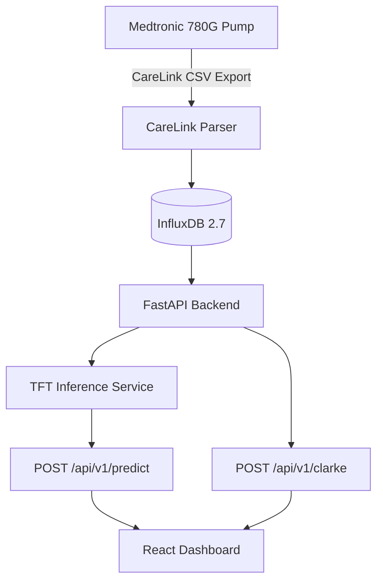

# 🧠 NeuroMetabolic Dashboard (NMD)

> AI-driven decision-support system for Type 1 Diabetes management — predicting glycemic trends using Temporal Fusion Transformers and real closed-loop pump data.

[](https://github.com/Radian20Hz/NeuroMetabolic-Dashboard/actions)
[](https://python.org)
[](LICENSE)
[](https://github.com/Radian20Hz/NeuroMetabolic-Dashboard)

> **Phase 3 complete.** The TFT inference pipeline, Clarke Error Grid evaluator, and full-stack dashboard are live and running on real CGM data from a Medtronic 780G.

---

## 💡 Motivation

This project is built by a T1D patient, not just *for* T1D patients.

The developer wears a **Medtronic 780G closed-loop insulin pump** every day — which means this is not an academic exercise. The data this system processes is the same data that determines insulin delivery in real life. That personal stake drives every engineering decision: precision over convenience, explainability over black-box accuracy, patient safety above all else.

---

## 📌 What it does

The **NeuroMetabolic Dashboard** integrates real-time CGM data from the Medtronic 780G with a **Temporal Fusion Transformer (TFT)** model to provide:

- 📈 **60-minute glucose forecasting** — 12 × 5-min steps with 10th/50th/90th quantile confidence intervals
- 🔬 **Clarke Error Grid Analysis** — deterministic zone classification (A–E) per Clarke et al. 1987
- 📊 **ADA 2024 glycemic metrics** — TIR, GMI, CV, std dev computed on real pump data
- 🩺 **Clinical zone classification** — ADA 2024 hypoglycemia/hyperglycemia thresholds
- 📥 **CareLink CSV ingestion** — parses real Medtronic 780G export format

> ⚠️ **Medical Disclaimer:** NMD is a decision-support research tool only. It is not a replacement for professional medical advice or automated insulin delivery (AID) logic.

---

## 🏗️ Architecture


```mermaid
graph TD
  A[Medtronic 780G Pump] -->|CareLink CSV Export| B[CareLink Parser]
  B --> C[(InfluxDB 2.7)]
  C --> D[FastAPI Backend]
  D --> E[TFT Inference Service]
  E --> F[POST /api/v1/predict]
  F --> G[React Dashboard]
  D --> H[POST /api/v1/clarke]
  H --> G
```

---

## 🛠️ Tech Stack

| Layer | Technology |
|---|---|
| **Backend** | Python 3.11, FastAPI |
| **Database** | InfluxDB 2.7 (time-series) |
| **ML Model** | PyTorch, Temporal Fusion Transformer (pytorch-forecasting) |
| **Inference** | `.ckpt` checkpoint — ONNX export abandoned (data-dependent symbolic shapes) |
| **Frontend** | React 19, TypeScript, Recharts, Tailwind CSS |
| **CI/CD** | GitHub Actions, flake8 |
| **Containerization** | Docker, Docker Compose |

---

## 📁 Project Structure

```
neurometabolic-dashboard/
├── backend/
│   ├── app/
│   │   ├── api/              # Route handlers (glucose, predict, clarke)
│   │   ├── core/             # Config, pydantic-settings
│   │   ├── models/           # Pydantic schemas
│   │   └── services/         # Business logic
│   │       ├── carelink_parser.py
│   │       ├── carelink_scraper.py
│   │       ├── clarke_egz.py       # Clarke EGA classifier
│   │       ├── glucose_validator.py
│   │       ├── influxdb_service.py
│   │       └── tft_inference.py    # TFT inference service
│   └── tests/
├── frontend/
│   └── src/
│       ├── components/
│       │   ├── ClarkeErrorGrid.tsx
│       │   ├── GlucoseChart.tsx    # CGM trace + TFT forecast overlay
│       │   ├── StatsCards.tsx
│       │   └── UploadPanel.tsx
│       ├── api/
│       └── types/
├── ml/
│   ├── data/processed/       # training.parquet (OhioT1DM, gitignored)
│   ├── models/               # TFT checkpoints (gitignored)
│   └── scripts/              # Training & preprocessing
├── docker-compose.yml
└── .github/workflows/ci.yml
```

---

## ✅ Progress

### Phase 1 — ETL Pipeline ✅
- CareLink CSV parser — real Medtronic 780G export format
- InfluxDB service — write/query glucose time-series
- REST API — `/upload`, `/latest`, `/classify`, `/statistics`
- GitHub Actions CI/CD (flake8 + pytest)
- 36 unit tests — all passing

### Phase 2 — Clinical Intelligence Layer ✅
- Glucose Validator — ADA 2024 clinical zone classification
- Glycemic statistics engine: TIR, GMI (Bergenstal et al. 2018), CV
- Docker Compose stack — end-to-end pipeline with real pump data
- CareLink API scraper (auth flow in progress)

### Phase 3 — TFT Model + Inference ✅
- OhioT1DM dataset preprocessing — 85,896 samples, 6 subjects, 14 features
- TFT training — `val_loss=1.710`, **MARD=1.09%**
- ONNX export attempted → abandoned (`GuardOnDataDependentSymNode` in TFT encoder)
- FastAPI `/predict` endpoint — 60-min forecast, quantile output
- Clarke Error Grid Analysis — `POST /api/v1/clarke`, zones A–E
- Full-stack dashboard — CGM trace + forecast overlay + Clarke scatter plot

### Phase 4 — Multi-patient Generalization 📅
- Subject-agnostic inference (currently requires OhioT1DM subject ID)
- Proactive hypoglycemia alert system (20-min lead time)
- "What-If" metabolic simulator — meal/activity impact visualization
- Nightscout integration — live CGM data ingestion

---

## 📊 Model Validation

| Metric | Target | Achieved |
|---|---|---|
| **MARD** | < 10% | **1.09%** ✅ |
| **Clarke EGA zones A+B** | > 95% | Evaluated per session |
| **val_loss (QuantileLoss)** | — | **1.710** |

Model: `tft-epoch=47-val_loss=1.7104.ckpt` — trained on OhioT1DM (subjects 559, 563, 570, 575, 588, 591).

---

## ⚙️ Getting Started

### Prerequisites

- Python 3.11+
- Docker + Docker Compose
- Node.js 20+

### Installation

```bash
git clone https://github.com/Radian20Hz/NeuroMetabolic-Dashboard.git
cd NeuroMetabolic-Dashboard

# Start full stack (InfluxDB + backend + frontend)
docker compose up -d

# Or run backend locally
cd backend
python -m venv venv
source venv/bin/activate
pip install -r requirements.txt

cp .env.example .env  # fill in InfluxDB credentials

uvicorn app.main:app --host 0.0.0.0 --port 8000 --reload
```

API docs: `http://localhost:8000/docs`

Frontend: `http://localhost:3000`

### Running tests

```bash
cd backend
pytest tests/ -v
```

### TFT Inference

The TFT model requires:
1. Checkpoint in `ml/models/tft-*.ckpt`
2. Reference dataset in `ml/data/processed/training.parquet`
3. `ml/` volume mounted in Docker (see `docker-compose.yml`)

Subject IDs must match OhioT1DM training set: `559, 563, 570, 575, 588, 591`.

---

## 🔒 Data Privacy

- **OhioT1DM Dataset** — fully de-identified academic benchmark
- Personal CGM data never committed to repository
- InfluxDB credentials stored in `.env` (gitignored)

---

## 📄 License

MIT License — see [LICENSE](LICENSE) for details.

---

*Built by a 16-year-old T1D developer from Poland. Long-term goal: MEXT Embassy Track Scholarship 2028 — Biomedical Engineering in Japan.*
