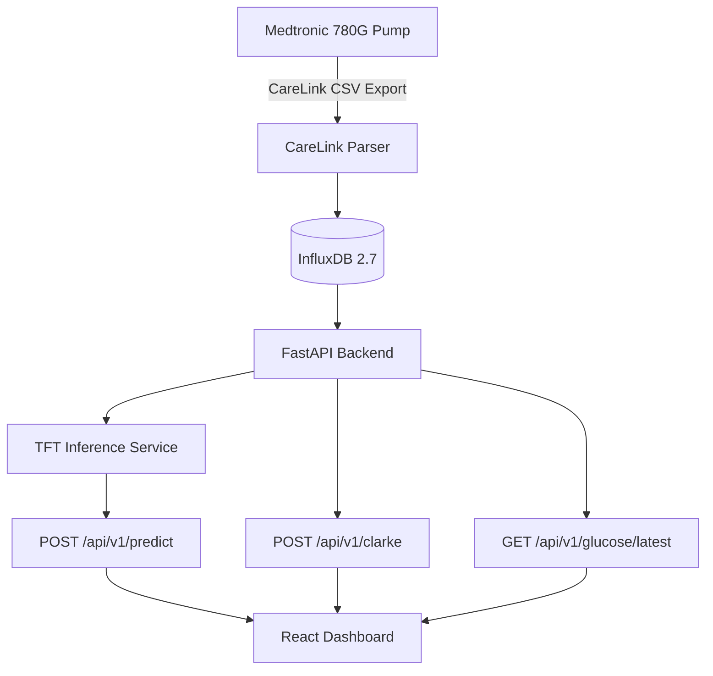

# 🧠 NeuroMetabolic Dashboard (NMD)

> AI-driven decision-support system for Type 1 Diabetes management — predicting glycemic trends using Temporal Fusion Transformers and real closed-loop pump data.

[](https://github.com/Radian20Hz/NeuroMetabolic-Dashboard/actions)
[](https://python.org)
[](LICENSE)
[-brightgreen)](https://github.com/Radian20Hz/NeuroMetabolic-Dashboard)

> **Phase 9.1 complete** — Production-ready TFT inference pipeline with biexponential pharmacokinetics, asymmetric clinical loss, and strict Leave-One-Subject-Out (LOSO) cross-validation. Live and running on real CGM data from a Medtronic 780G.

---

## 💡 Motivation

This project is built by a T1D patient, not just *for* T1D patients.

The developer wears a **Medtronic 780G closed-loop insulin pump** every day — which means this is not an academic exercise. The data this system processes is the same data that determines insulin delivery in real life. That personal stake drives every engineering decision: precision over convenience, explainability over black-box accuracy, patient safety above all else.

---

## 📌 What it does

- 📈 **60-minute glucose forecasting** — 12 × 5-min steps with 10th/50th/90th quantile confidence intervals via Temporal Fusion Transformer.
- 🧬 **Biexponential Pharmacokinetics** — Models Humalog/NovoRapid rapid-acting insulin via the Berger (1992) equation to calculate accurate dynamic Insulin-on-Board (IOB).
- ⚠️ **ClinicalQuantileLoss** — A custom asymmetric PyTorch loss function heavily penalizing false negatives in the hypoglycemic range (<70 mg/dL), prioritizing patient safety.
- 😰 **Physiological Stress Fusion** — Multimodal Z-score composite (Heart Rate, GSR, Skin Temperature) to anticipate stress-induced hyperglycemia.
- 🔬 **Clarke Error Grid Analysis** — Deterministic zone classification (A–E) per Clarke et al. 1987, paired against real CGM readings.
- 📊 **ADA 2024 glycemic metrics** — TIR, GMI (Bergenstal 2018), CV, std dev computed on real pump data.
- 📥 **CareLink CSV ingestion** — Parses real Medtronic 780G export format.

> ⚠️ **Medical Disclaimer:** NMD is a research/decision-support tool only. It is not a replacement for professional medical advice or automated insulin delivery (AID) logic.

---

## 🏗️ Architecture


```mermaid
graph TD
  A[Medtronic 780G Pump] -->|CareLink CSV Export| B[CareLink Parser]
  B --> C[(InfluxDB 2.7)]
  C --> D[FastAPI Backend]
  D --> E[TFT Inference Service]
  E --> F[POST /api/v1/predict]
  F --> G[React Dashboard]
  D --> H[POST /api/v1/clarke]
  H --> G
  D --> I[GET /api/v1/glucose/latest]
  I --> G
```

---

## 🛠️ Tech Stack

| Layer | Technology |
|---|---|
| **Backend** | Python 3.12, FastAPI |
| **Database** | InfluxDB 2.7 (time-series) |
| **ML Model** | PyTorch, PyTorch Lightning, PyTorch Forecasting (Temporal Fusion Transformer) |
| **Optimization** | AdamW, OneCycleLR, 16-mixed precision training |
| **Frontend** | React 19, TypeScript, Recharts, Tailwind CSS |
| **CI/CD** | GitHub Actions, flake8, pytest |
| **Containerization** | Docker, Docker Compose |

---

## ✅ Progress

### Phase 1 & 2 — ETL & Clinical Intelligence Layer ✅
- CareLink CSV parser — real Medtronic 780G export format
- InfluxDB service — write/query glucose time-series
- Glucose Validator — ADA 2024 clinical zone classification (5 zones)
- Glycemic statistics engine: TIR, GMI, CV
- React frontend — GlucoseChart, StatsCards, UploadPanel
- 36 unit tests — all passing

### Phase 3 — Initial TFT Prototype ✅
- OhioT1DM preprocessing — 85,896 samples, 6 subjects.
- Baseline TFT model training and full-stack dashboard integration.
- `POST /api/v1/predict` and `POST /api/v1/clarke` fully operational.

### Phase 9.1 — Clinical-Grade Architecture (Current) ✅
- **Strict Anti-Leakage Pipeline:** Eliminated temporal data leakage using zero-leak lag warmups (expanding means on shifted series).
- **True LOSO CV:** Implemented Leave-One-Subject-Out cross-validation for rigorous generalization proof.
- **Advanced Feature Engineering:** Added biexponential IOB, stress composites, insulin stacking detection, and glucose jerk (3rd derivative).
- **Custom Loss Function:** Implemented `ClinicalQuantileLoss` to actively punish the optimizer for missing impending hypoglycemia.
- **Hardware Optimization:** PyTorch Lightning upgrade with `accumulate_grad_batches`, `OneCycleLR`, and mixed precision.

### Phase 10 — Future Scope 📅
- Proactive hypoglycemia alert system (20-min lead time)
- XAI — TFT attention map visualization
- Bilingual documentation (EN/JP)

---

## 📊 Model Performance & Scientific Integrity

*Note: Early iterations of this project (Phase 3) displayed a ~1.09% MARD. During rigorous architectural review, this was identified as an artifact of soft temporal data leakage in trailing rolling windows. In the pursuit of strict scientific integrity, the pipeline was rebuilt from the ground up.*

**Phase 9.1 Targets (Strict LOSO Evaluation):**
| Metric | Target |
|---|---|
| **MARD @ 60 min** | ~ 15.0% (Real-world clinical standard) |
| **Clarke EGA zones A+B** | > 95% |
| **Hypoglycemia Sensitivity** | Heavily optimized via `ClinicalQuantileLoss` |

*(Training runs for Phase 9.1 are currently computing. Final benchmarks will be updated shortly).*

---

## 📥 Data Ingestion

**Current workflow:** Manual CSV export from carelink.minimed.eu → upload via NMD dashboard Upload panel.

**Why no auto-sync?** CareLink EU automated scraping is blocked by Medtronic. The MAG endpoint (`mdtlogin-ocl.medtronic.com:443`) used by all known third-party clients returns connection refused. A formal API access request has been submitted to Medtronic Developer Relations.

---

## ⚙️ Getting Started

### Prerequisites
- Python 3.12+
- Docker + Docker Compose
- Node.js 20+

### Quick start (Docker)
```bash
git clone [https://github.com/Radian20Hz/NeuroMetabolic-Dashboard.git](https://github.com/Radian20Hz/NeuroMetabolic-Dashboard.git)
cd NeuroMetabolic-Dashboard

cp backend/.env.example backend/.env  # fill in InfluxDB credentials

docker compose up -d
```
- Frontend: `http://localhost:3000`
- API docs: `http://localhost:8000/docs`

### TFT Inference setup
The TFT model requires:
1. Checkpoint at `ml/models/tft-*.ckpt`
2. Reference dataset at `ml/data/processed/training.parquet`
3. `ml/` volume mounted in Docker (configured in `docker-compose.yml`)

---

## 🔒 Data Privacy

- **OhioT1DM Dataset** — fully de-identified academic benchmark.
- Personal CGM data is never committed to the repository.
- InfluxDB credentials stored in `.env` (gitignored).

---

## 📄 License

MIT — see [LICENSE](LICENSE) for details.

---

*Built by a 16-year-old T1D developer from Poland. Long-term goal: MEXT Embassy Track Scholarship 2028 — Biomedical Engineering in Japan.*
